I've been a software engineer for most of my career.

But with Physical AI [turning a corner](https://itcanthink.substack.com/p/in-context-learning-results-hint) with general models able to one-shot new tasks, robotics seems like the next frontier. Like how I jumped into the deep end of the pool with iOS programming 16 years ago, I know the best way to get started is to get my feet wet. So here I am, training a policy and trying to build my first experiment!

Data is *scarce* in the robotics world. The way data is used today for most VLA models is to pretrain on generic egocentric data, and posttrain using teleoperation data and RL. This of course, is changing as we speak with [In-Context Learning models](https://skild.ai/blogs/s1).

However, the underlying notion is still the same: useful data is scarce and important.

As I read more about egocentric videos and policy training, I learned that **wristview videos provide a secondary viewpoint to help train policies better** ([Hsu et al., 2022](https://arxiv.org/abs/2203.12677)). I started thinking: could we provide more useful data to policies without having to redo much work?

Scouring the internet led me to the [WARPED paper](https://arxiv.org/html/2604.10809v1). It wasn't the only route. [Kim, Wu and Finn](https://arxiv.org/abs/2307.05959) strapped a real camera to a human forearm and masked out the hand, and [WristWorld](https://arxiv.org/abs/2510.07313) generates wrist views from third-person robot footage with a video world model. WARPED was the one that started from a head camera, which is the camera I could actually wear. Though the paper's not been accepted yet, it did seem very promising, and I was keen on replicating parts with a minimal setup. This would also come with a few differences: I'd be using cheaper cameras (Arducams and my iPhone), a much smaller desk, and no roboarm.

**So the question I set out to answer was a build question: can I take video from a camera on my head, and produce video from a camera that was never on my wrist?**

<video preload="metadata" src="clip_side_by_side_demo3.mp4" controls muted playsinline width="100%"></video>
_Left: egocentric camera. Right: generated wrist video._

Today, I'll share my process, [my code](https://github.com/sidwyn/ego2wrist), and lessons learned. Fair warning on the second half: I did eventually build an experiment to test the videos, and the answer was not the one I expected. Working out what it was actually telling me took longer than building the pipeline did.

---

## Why even build this

Research has shown that wrist videos provide an useful alternate viewpoint, and improves policy training by [up to 30 percentage points](https://robomimic.github.io/study/) on certain tasks (For instance to move an aluminium can, a wrist camera increases success from 43.3% to 73.3%).

**Why are wrist videos important?** Human head-mounted egocentric video doesn't always have the right view. Think about this: there are times when the hands leave the frame to do something else, or the object is too small to be in view of the egocentric cam.

Which means that if we want to add wrist video, we either collect real wrist videos, or try to generate them from a room scan.

**Why is collecting real wrist videos hard?**
It's expensive. Even the [cheapest Arducam cameras](https://www.amazon.com/dp/B09BR1RNSN) are roughly \$45 each (aka \$90 for both wrists). Multiplied by your number of field collectors, this number starts to add up fast if you're collecting thousands or millions of hours of video.

**Could we generate synthetic wrist videos from egocentric video alone, with nothing else?**
This is hard, and honestly, not advisable. A head camera a meter and a half away just doesn't capture enough of the working area up close to invent a view from 25 cm.

**What can we do instead then to synthesize wrist videos?**
We can scan the room and working area. The more data here the better. We can generate an approximate room and scene reconstruction. A room scan costs as little as 3 minutes and is only needed once.

Of course, the drawback for this approach is that you can't easily run this pipeline on open-source egocentric data like [Egocentric-100k](https://huggingface.co/datasets/builddotai/Egocentric-100K/tree/main)), since there aren't accompanying room scans.

---

## Process

The equipment I used was simple: an iPhone 16 Pro with the [Blackmagic Cam iOS app](https://apps.apple.com/us/app/blackmagic-camera/id6449580241) on my head, and an [Arducam](https://www.amazon.com/dp/B09BR1RNSN) for the wrist camera.

After several tries, I had to shift the wrist camera to my bicep, about 45 cm from my fingertips, pointing down my arm at my hand. The Arducam's lens was too narrow to be useful any closer. While I got a much better viewpoint this way, this choice also cost me later. More on that below.

I then filmed two things:

1. **A complete scan of the room.** I spent about 4 minutes filming this scan from a variety of angles, from both far away (1.5m) and close up (15cm close.).

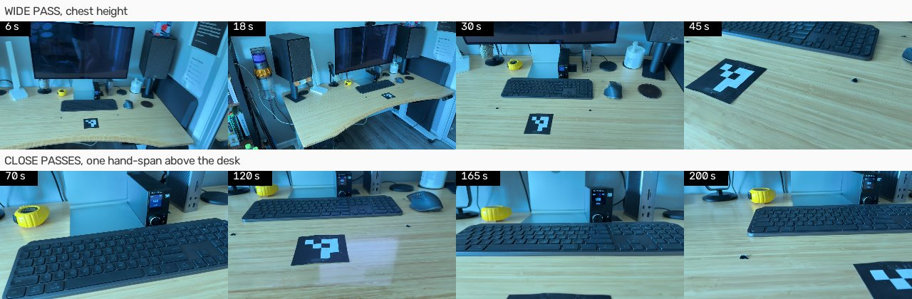
<video preload="metadata" src="clip_scan.mp4" controls muted playsinline width="100%"></video>

_Samples from my room scan. Lighting is slightly different here, which is another problem I had to control for._

2. **Demos on a simple task.** In my case, the task was a simple lift. I grasped a cube, lifted it about 15 cm, held for a second, put it back, then moved the hand away.
   I filmed 60 takes across 6 sessions (10 takes per session), knowing that I would lose some to the pipeline. I used whistles to sync the clocks between both the wrist and ego cams. If I'd filmed each individual take separately, this would have taken exponentially more time.

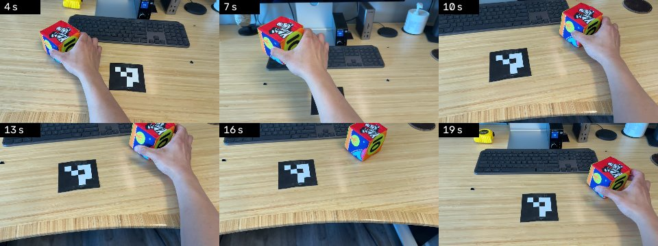
<video preload="metadata" src="clip_demo.mp4" controls muted playsinline width="100%"></video>

## Rendering pipeline

My pipeline runs in six stages, turning raw egocentric video + the room scan into a synthetic wrist-camera video. As a reminder, the code is open source and lives [here](https://github.com/sidwyn/ego2wrist).

**1. Ingestion.** First, we read camera intrinsics off them. We sample the scan at 6 fps and the demos at 20 fps. This provided enough frames to remove duplicates. We also throw away blurry frames at this step. ([code pointer](https://github.com/sidwyn/ego2wrist/blob/main/src/wristview/stages/s00_ingest.py))

**2. Scene reconstruction.** Now we need to know what the room looks like in 3D. Running [COLMAP](https://colmap.github.io/) over the scan frames for structure from motion (SfM) gives us a camera pose for every frame and a sparse point cloud of the room. 

The reconstruction has no units of its own, so we use the 100mm x 100mm [ArUco](https://docs.opencv.org/4.x/d5/dae/tutorial_aruco_detection.html) marker on the desk to set the scale. We then train a [3D Gaussian splat](https://repo-sam.inria.fr/fungraph/3d-gaussian-splatting/) on those poses, and use this splat to render the scenes later. ([code pointer](https://github.com/sidwyn/ego2wrist/blob/main/src/wristview/stages/s01_scene.py))

> **Requires GPU.** Since [gsplat](https://github.com/nerfstudio-project/gsplat) is CUDA-only, I had to rent GPUs (4090s) from [RunPod](https://www.runpod.io/) for this (shoutout to them here for how easy it was to use! It worked with Claude Code really well).

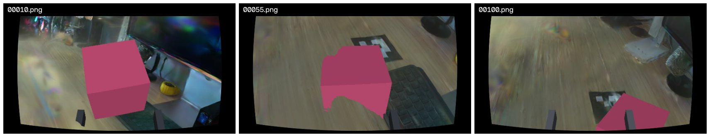
_The Gaussian splat rendered from three points along a wrist trajectory. At this point, there's no gripper or object drawn yet. But you can already start to see the fidelity of the reconstruction, which is pretty cool._

**3. Localize viewpoint.** Currently, we know what the room looks like, however, we still do not know where I was standing in it during each demo. To tackle this, we have to pull 10 most similar scan frames for every frame within the demo, match them with [SuperPoint](https://github.com/magicleap/SuperPointPretrainedNetwork) and [LightGlue](https://github.com/cvg/LightGlue), and solve the pose with [PnP](https://en.wikipedia.org/wiki/Perspective-n-Point). 

This means we end up with a head camera position and orientation for every frame of every take, in the same coordinates as the room. ([code pointer](https://github.com/sidwyn/ego2wrist/blob/main/src/wristview/stages/s02_localize.py))

**4. Estimate hand and object.** With the camera placed, we can now locate the things that move. We track the hand with [WiLoR](https://github.com/rolpotamias/WiLoR), which returns 3D landmarks. (I picked WiLoR over [HaMeR](https://github.com/geopavlakos/hamer) since I ran into some python build issues.) 

For the object we use two models in sequence to build the reconstruction. [Grounding DINO](https://github.com/IDEA-Research/GroundingDINO) takes a text prompt and returns a rough box with a confidence score. Then [SAM 2](https://github.com/facebookresearch/sam2) turns that box into an exact per-pixel mask and tracks it through the rest of the clip.
([code pointer](https://github.com/sidwyn/ego2wrist/blob/main/src/wristview/stages/s03_estimate.py))

**5. Retarget.** In this step we turn the hand pose into a two-finger gripper, and build a trajectory out of it. We take the thumb-to-index distance and use it as the jaw width. We cap that at about 8.5 cm, which is roughly what a parallel gripper opens to. Then we resample onto a 15 Hz control rate, so each row of the dataset is something a policy could be asked to output. ([code pointer](https://github.com/sidwyn/ego2wrist/blob/main/src/wristview/stages/s04_retarget.py))

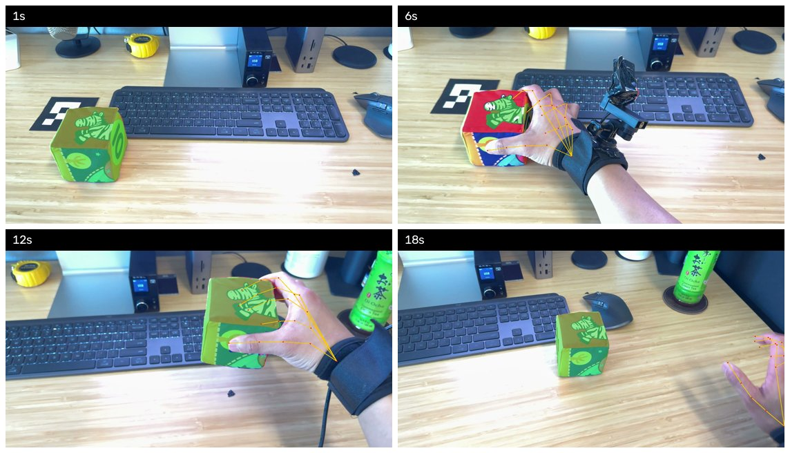
_Stage 4. WiLoR's 21 hand landmarks in orange, SAM 2's per-pixel object mask is also shown in green and tracked across the clip._

**6. Render wrist video.** Finally we put the virtual wrist camera on that trajectory. We render the splat through it frame by frame, then composite the gripper and the object back in. ([code pointer](https://github.com/sidwyn/ego2wrist/blob/main/src/wristview/stages/s05_render.py))

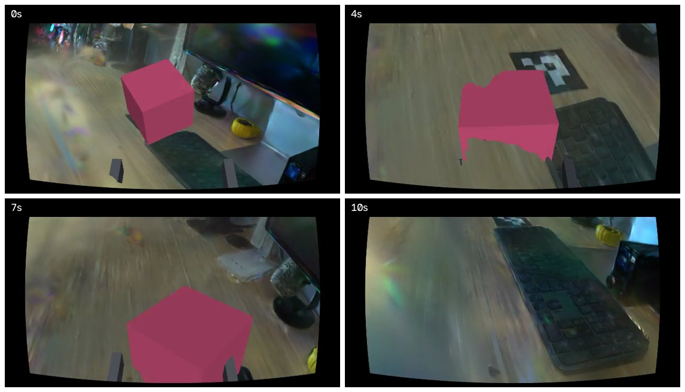
_The finished wrist view: splat rendered through the virtual wrist camera, with the gripper and object composited in. Again, was running into some lighting issues here, but we managed to figure it out at the end._

<video preload="metadata" src="hero_reach_to_grasp.mp4" controls muted playsinline width="100%" aria-label="A full reach-to-grasp, rendered."></video>

## What building this process taught me

I made _so_ many mistakes building this experiment, so I hope this helps anyone who is trying to attempt something similar.

### 1. Use the right camera for the job

I started with the camera strapped to my wrist, but unfortunately it didn't give the pipeline enough to work with. At that range the cube fills almost the whole frame. 

I got either too much hand, or too little hand. That left nothing for the matcher to anchor on, and nothing for the splat to draw.

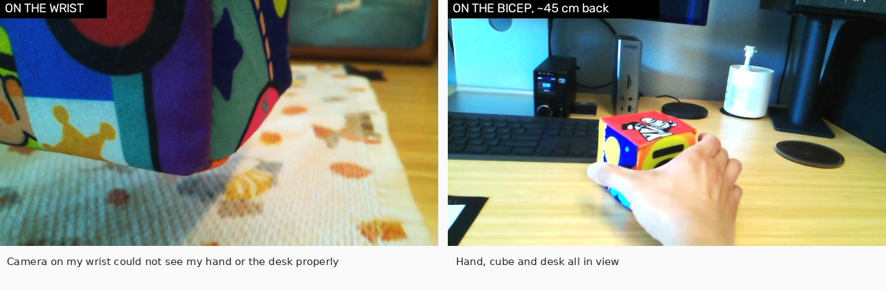

_The same task from both mounts. On the wrist, the cube fills the frame. You cannot see my hand, the desk, or anything the room scan recorded. From the bicep, the hand, the cube and the desk are all in shot which made it much easier to reconcile frames._

To fix this, I first looked at how other people tackle this issue. The answer lay in the hardware. Most wrist cameras in these setups are fisheye, or at least have a wide angle lens. I unfortunately didn't have that option with the Arducam that I ordered, and I didn't want to return a camera I had already used so much. 

Instead of widening the lens, I moved the camera back onto my bicep and let the extra distance do the same job.

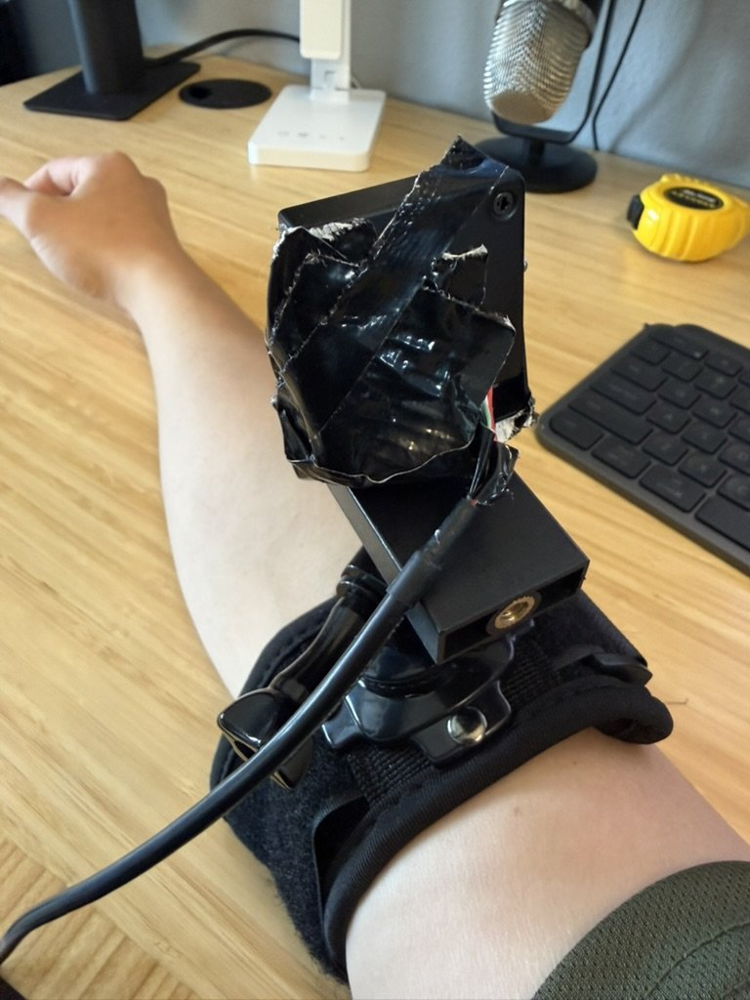

This came back to bite me in the experiment. The real camera sat at 45 cm, while the rendered one sat at the 25 cm standoff that UMI uses. 

So when I compared the two later on, I was partly comparing two camera positions rather than two ways of making an image. The renders weren't useless, but this made the comparison much muddier than it needed to be.

### 2. Don't become a message bus between yourself and your AI agent.

In Stage 6, when I trained a splat and rendered a few frames out of it, I only got noise.

The number people use here is PSNR (peak signal-to-noise ratio). It compares a rendered image against the real photo it's supposed to reproduce, and higher is better. A working splat sits around 30 dB, while mine came out at **7.21 dB**, which is roughly what you'd score by rendering television static. 😅

So I did the obvious thing and went hunting for the corruption. Was the file damaged on the way down from the pod? Had the training set drifted out of sync with the scan? I pointed Claude Code at each of these in turn and let it dig. This went on for days, and used a fair number of tokens.

**But it turns out, the splat had been fine the whole time.**

The actual problem was in the renderer, which I'd written earlier on my Mac (bad idea - don't try to do this without a proper GPU). To draw a splat you chop the image into small tiles and work out, for each tile, which Gaussians land on it. 

My version had a fixed ceiling on how many Gaussians one tile could hold, and when more than that showed up **it quietly dropped the rest, up to 11M of them**. I put the same file back on the GPU, rendered it with gsplat instead of my code, and it scored 30.46 dB. ([code pointer](https://github.com/sidwyn/ego2wrist/blob/main/src/wristview/splatqc.py))

But the renderer isn't really the lesson here. The lesson is what I was doing while all that was happening. 

Somewhere in those days I stopped being the person making decisions and turned into a message bus, handing hypotheses to Claude Code and handing results back, without once stopping to ask whether we were even looking in the right place. It happened gradually enough that I didn't notice it happening. Anyways, hard lesson learned. You always need a human in the loop.

---

### 3. Put gates before the expensive step

A Gaussian splat's only built out of the frames you feed it. If you try to ask it for a view from somewhere I never stood, it tries to fills the gap in with random pixels. And sometimes, the result looks convincing if you don't look at it properly.

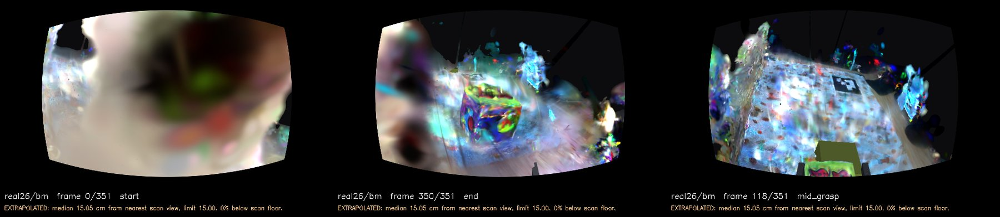
_Three frames from the same clip. All three are extrapolated: the typical frame sits 15.05 cm from the nearest place the scan stood, against a limit of 15.00. The first two are obviously wrong. The one on the right has a desk, a towel, the marker and the cube in it, and is slightly more promising._

To prevent this, we introduced a gate to check these renders. This check walks through the frames of a rendered wrist video, finds the nearest spot the phone actually stood during the scan, and measures how far apart they are.

If the typical frame sits more than 15 cm away from anywhere the scan visited, I treat immediately stop the run. (This 15 cm is a threshold I chose, since most grippers are rendered at 25cm..) Past that 15cm, the renders would look bad to me, which would be enough to stop spending GPU time on them.

Here's the sample code:

```python
# Gate where I measure gap from scan floor
MAX_VIEWPOINT_GAP_M = 0.15
MAX_FRACTION_BELOW_SCAN_FLOOR = 0.10

gaps = np.linalg.norm(render[:, None, :] - scan[None, :, :], axis=2).min(axis=1)
scan_floor = float(_heights(scan, plane_normal, plane_offset).min())
render_heights = _heights(render, plane_normal, plane_offset)
below = float((render_heights < scan_floor).mean())
```

([code pointer](https://github.com/sidwyn/ego2wrist/blob/main/src/wristview/coverage.py#L64-L68))

I initially placed the check after rendering the frames, which was really expensive. Rent the pod, wait for it to provision, train the splat for 40 minutes, render frames. And then the check finally runs, right at the end, after all the GPU money is spent.

I eventually brought a cheaper step to Stage 1 that measures whether the scan can constrain geometry. This was much better and caught most of the invalid frames way ahead of time. ([code pointer](https://github.com/sidwyn/ego2wrist/blob/main/src/wristview/coverage.py#L75))

---

### 4. Rich texture is not necessarily useful.

Structure from motion works by picking out small distinctive spots in each frame, called keypoints, and then finding the same spot again in the next frame. Two frames that share enough matched keypoints can be placed relative to each other, and that's how you get camera positions out of a video at all.

My bare wooden desk didn't give it much to work with, and the matcher kept complaining. So I went looking for a surface with more going on, and landed on.. my kitchen towel (see pic below). There's dogs, pumpkins, a woven weave. Plenty to look at... should be easy to build key points in the splat, right?

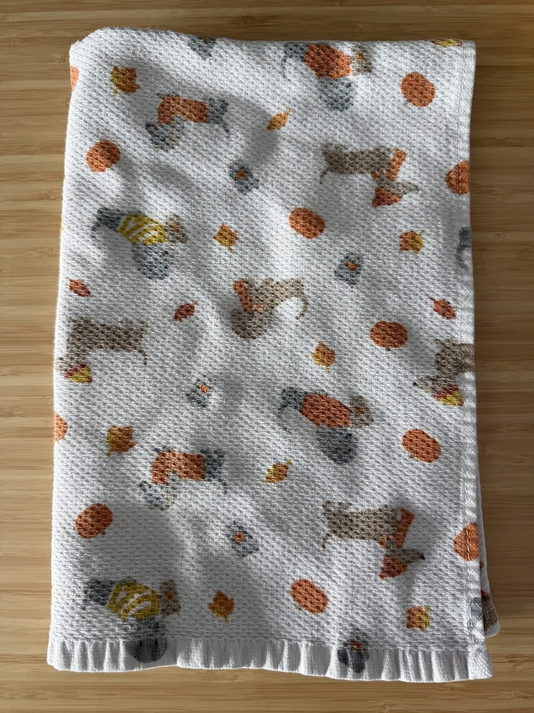
_The kitchen towel I shot the demos on. Yes, it's a fall-themed towel._

Well, while keypoints (marked points to measure across frames) per frame went up 25 to 40%, which felt like a win for about ten minutes, the number of actual matches had barely moved at all.

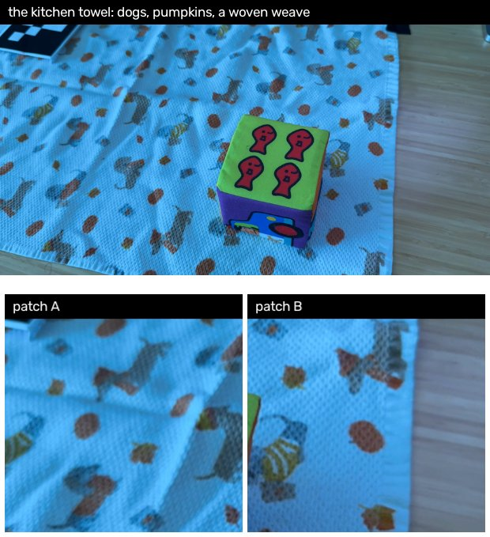

Since every dog on that towel looks like every other dog on that towel, the matcher would pick up a spot in one frame, go looking for it in the next, and find forty equally good candidates. Because it picked wrong a lot, about half my matches came out geometrically wrong.

And so back to the bare desk I went. There were fewer keypoints to match this time, and it was still blurry in places, but at least the matcher could tell one bit of wood from another.

---

## Well, is the rendered video any good?

Now I had the generated videos. Were they actually any good? Let's take a look at a few of them.

<video preload="metadata" src="render_demo3.mp4" controls muted playsinline width="100%"></video>
_One of the renders. Hey, not bad! We see it moving from right to left._

<video preload="metadata" src="render_demo5.mp4" controls muted playsinline width="100%"></video>

_OK, maybe not that great. The cube has flown away. But the splat is still pretty good._

With so many rendered videos, the obvious test was to hold the two side by side. I had a real wrist video and a rendered one of the same reach, so I'd measure the difference between them. Simple, and straightforward, right..?

Well, not at all. To line those two pictures up you need to know where the real wrist camera was, to about a millimeter, and recovering that from video turns out to be a gigantic problem. I didn't know that just yet, but my naive self went off to build this.

Remember how I talked about shifting the wrist camera? This happens here.

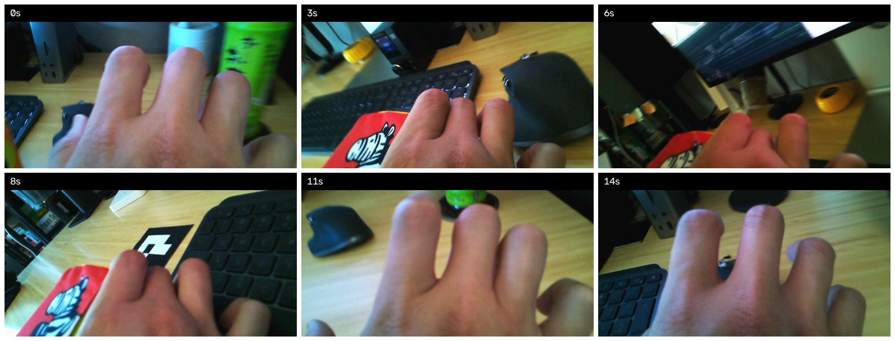
_Early demos when the camera was still attached to my wrist. Reconstruction from this angle proved much harder than I expected because well, it really wasn't capturing anything. And thus it was even harder trying to match rendered videos with this angle._

First, I wanted to ask the wrist cam "which part of the room is this?" and get a position back. In practice only **28%** of those points gave me a useful position. Most of them ended up placing my camera inside a wall. 😅

So I tried a different route.. I knew I wanted to have the ego and wrist cameras match somehow in order to know where the wrist camera was. This time, I figured I'd give the camera its own printed ArUco marker (a different ID, of course) and wrap it around the strap.

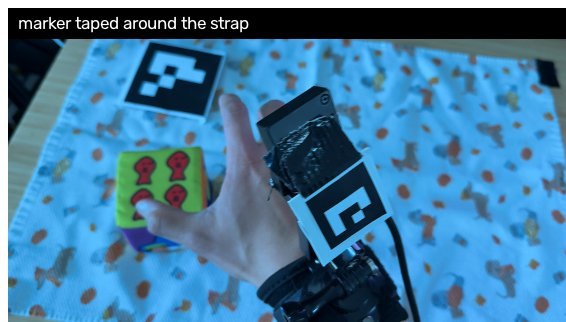
_Attempt two: a second marker taped around the strap. Wrapped around a curve, it read in 2 frames out of 1384._

However, what I hadn't thought about is that the marker needs to be flat. Wrapping it around a curved strap made things worse instead of better. Only 2 out of 1300+ frames registered.

I spent hours on trying to get this work before I realised I shouldn't be doing it at all. Looking at the WARPED paper again, they never compare pixels either. They report task success and nothing else. So I stopped trying to measure the render, and started measuring what a policy does with these videos instead. 

_One caveat with this approach:_ the WARPED paper does have a robot arm, and at this point, I still don't. I wanted to push the limits of what we could do without one.

---

## The experiment I ended up building

I had 53 demonstrations after throwing out a few bad takes. I kept 43 for training and held out ten for scoring.

With these, I trained three policies. Same demos, same everything, except which cameras each one got to see:

- **A**: head camera only
- **B**: head camera plus the rendered wrist video
- **C**: head camera plus the real wrist video

**How do you score a policy without a robot?** You ask it to guess. Each policy looks at the current frame and predicts where the gripper goes over the next eight steps at 15 Hz, about half a second of movement. I then measure how far that guess is from what my hand actually did, in millimeters. The lower the better.

I also ran three baselines to know what "bad" looks like. One repeats whatever the last move was. One always guesses the average move. One is a policy with no camera at all, just the hand position.

**How many times do you train each one?** Five. I learned this the hard way. If you train a policy once, you get one number, and you have no idea how much of that number is the policy and how much is the random seed. So each of the three policies was trained five times with five different seeds, for 10,000 steps each, with a learning rate that decays to zero. I did fifteen runs, five rented 4090s, about four hours, $14.47.

I also wrote the decision rule down before the first pod started, so I couldn't talk myself into anything afterwards. A difference between two policies only counts if its mean is bigger than twice its standard error, and the sign agrees on at least four of the five seeds.

## Results

Let's take a look.

| Policy                        | s1   | s2   | s3   | s4   | s5   | Mean        | sd   |
| ----------------------------- | ---- | ---- | ---- | ---- | ---- | ----------- | ---- |
| Repeat my last move           |      |      |      |      |      | **3.72 mm** |      |
| Always guess the average move |      |      |      |      |      | 6.14 mm     |      |
| No camera, just hand position |      |      |      |      |      | 6.63 mm     |      |
| **A** Head camera             | 3.64 | 3.74 | 3.65 | 3.78 | 3.81 | **3.72 mm** | 0.08 |
| **B** Head + rendered wrist   | 3.90 | 3.86 | 3.86 | 3.80 | 3.75 | **3.84 mm** | 0.06 |
| **C** Head + real wrist       | 3.77 | 3.68 | 3.72 | 3.70 | 3.61 | **3.70 mm** | 0.06 |

Now, the three policies of one seed share the same data order and the same GPU, so the fair comparison is seed by seed:

| Question                          | Difference | Mean     | Same sign | Verdict         |
| --------------------------------- | ---------- | -------- | --------- | --------------- |
| Does the real wrist camera help?  | A − C      | +0.03 mm | 3 of 5    | not established |
| Does the rendered wrist hurt?     | A − B      | −0.11 mm | 4 of 5    | not established |
| Real wrist against rendered wrist | C − B      | −0.14 mm | 5 of 5    | established     |

**So, does the real wrist camera help?** No. A minus C is 0.03 mm, and which one wins flips from seed to seed. The seed-to-seed spread is only 0.06 to 0.08 mm, so this isn't an effect hiding in noise, because there's no effect to hide.

That also means the number I originally set out to measure doesn't exist. I'd planned to report how much of the real camera's benefit the render recovered:

```
recovery = (A error - B error) / (A error - C error)
```

Thus the fraction has nothing to divide by. The real camera never beat the head camera, so there was no gap for the render to close. I'm not reporting a recovery number, because there isn't one.

**Does the rendered wrist hurt?** Probably a little, but not enough for me to say so. Four of the five seeds (not all) say yes, and the average is 0.11 mm worse. 

**Is the real wrist better than the rendered one?** Yes, by 0.14 mm, on every single seed. This is the only established result in the whole experiment. However, before you get excited, remember that neither of them beats the head camera alone.

Why is the render worse? I don't know for sure. My best guess is colour, not geometry. After normalisation, the rendered wrist frames sit much further from the ImageNet statistics my encoder expects than the real wrist frames do, and that was flagged before the runs started. A camera placement problem would look different from this.

**What about the top row?** Every policy ends up level with "repeat my last move". Head camera 3.72, real wrist 3.70, the dumb rule 3.72. The real-wrist policy edges below it on four of five seeds, but only just. My take is that lifting a cube on an empty desk is a very repeatable movement, so a rule that copies the last step is hard to beat. Pouring a cup of coffee or wiping a plate would probably be a different story.

One thing I didn't vary above is the encoder, and that's because I'd already tested it. Swapping the head-camera encoder from random weights to [R3M](https://arxiv.org/abs/2203.12601), which is pretrained on egocentric video, cut error by about 1 mm in an earlier run, from 6.56 to 5.61 mm. That's ten times the spread between any of the cameras, so every policy above uses R3M. I would definitely try a different encoder next time as well (see lesson #5 below.)

In total, training cost me about $18 and 24 hours of rented GPU time.

## What I'd do differently next time

After two weeks of building, I know how to transform egocentric to wrist views, but there's much more work to be done to translate this to be useful for a policy. Here's what I'd do differently in the future:

1. **Measure task success instead of millimeters.** A robot that picks up the cube 8 times out of 10 is a result anyone can read. A policy that's 0.14 mm better at guessing the next half second is not. WARPED only reports task success, and now I understand why.

2. **Pick a task that actually needs a wrist view.** Lifting a cube on an empty desk can be solved from the head camera alone, and the numbers say so. If I want to detect a wrist-view effect, I need a task where losing the wrist view actually hurts. Something with occlusion, like reaching into a drawer.

3. **Run several seeds and train to convergence before comparing anything.** With one seed you can't tell an effect from luck. Five seeds and a cosine learning rate got my noise floor down to 0.07 mm, which is small enough to trust a 0.1 mm difference. Get that floor first, then compare cameras.

4. **Fix the camera geometry before running anything.** My real camera sat on my bicep at 45 cm because my Arducam wasn't wide angle. The rendered one sat at the standard 25 cm. So B against C was partly comparing two camera positions, not two ways of making an image. A fisheye lens at the right distance would remove that entirely. Something like [this](https://www.amazon.com/Arducam-Computer-Fisheye-Microphone-Windows/dp/B07ZS75KZR) would probably work.

5. **Try other pretrained encoders.** R3M produced the largest change I saw short of training longer, so I'd push on it. [VIP](https://arxiv.org/abs/2210.00030) is the obvious next one: a [ResNet50](https://arxiv.org/abs/1512.03385) trained on the same Ego4D footage with a completely different training objective, so it separates "egocentric video helps" from "R3M's specific method helps". [ImageNet](https://www.image-net.org/) ResNet50 as the control tells me whether I'm measuring pretraining or just capacity. CLIP ViT-B/16 is what [WARPED](https://arxiv.org/html/2604.10809v1) actually used, and that's a transformer, not a ResNet, so it won't drop into my harness at all without custom encoder code.

6. **Augment the rendered demos, since that's the whole point of rendering.** WARPED turns 30 demos into 300 by re-rendering each one with the object moved, retextured, and the camera perturbed. I rendered each demo exactly once since I didn't want to spend more time than I had already.

7. **A different policy (e.g. pretrained VLAs) is perhaps worth a look.** I used a diffusion policy because WARPED did. ACT is cheaper to train and might separate the arms differently. Fine-tuning a pretrained VLA instead of training a policy from scratch is the direction the field is actually going, and [Ego-Pi](https://arxiv.org/abs/2606.08107) fine-tunes one on egocentric human data directly. Some options here are [SmolVLA](https://huggingface.co/lerobot/smolvla_base), which already lives inside lerobot so it would drop into my harness with the least work, and then also [π0](https://github.com/Physical-Intelligence/openpi) through openpi, and [OpenVLA](https://openvla.github.io/).

All in all this was a really fun experiment. I learned a ton: [WiLoR](https://github.com/rolpotamias/WiLoR), [Grounding DINO](https://github.com/IDEA-Research/GroundingDINO), [Gaussian splat training](https://repo-sam.inria.fr/fungraph/3d-gaussian-splatting/), and a lot about where checks belong. I hope this helps shed some light on turning egocentric into wrist videos, and hopefully you don't make the same mistakes I did.

*Thank you to Harry Freeman, author of the WARPED paper for answering a lot of my noob questions.*

## References

- Freeman, H. et al. _WARPED: Wrist-Aligned Rendering for Robot Policy Learning from Egocentric Human Demonstrations._ arXiv:2604.10809. [arXiv](https://arxiv.org/abs/2604.10809) · [author's PDF](https://harrynvfreeman.com/data/warped.pdf)

- Hsu, K., Kim, M. J., Rafailov, R., Wu, J. and Finn, C. _Vision-Based Manipulators Need to Also See from Their Hands._ ICLR 2022. arXiv:2203.12677. [arXiv](https://arxiv.org/abs/2203.12677). Why a wrist view is worth having at all.

- Kim, M. J., Wu, J. and Finn, C. _Giving Robots a Hand: Learning Generalizable Manipulation with Eye-in-Hand Human Video Demonstrations._ arXiv:2307.05959. [arXiv](https://arxiv.org/abs/2307.05959). A real camera on a human forearm, the route I did not take.

- Qian, Z. et al. _WristWorld: Generating Wrist-Views via 4D World Models for Robotic Manipulation._ arXiv:2510.07313. [arXiv](https://arxiv.org/abs/2510.07313). Generated wrist views from third-person robot video.

- Kim, J. W. et al. _Ego-Pi: VLA Fine-Tuning for Ego-Centric Human and Robot Data._ arXiv:2606.08107. [arXiv](https://arxiv.org/abs/2606.08107).

- Mandlekar, A. et al. _What Matters in Learning from Offline Human Demonstrations for Robot Manipulation._ CoRL 2021. arXiv:2108.03298. [arXiv](https://arxiv.org/abs/2108.03298) · [robomimic study](https://robomimic.github.io/study/). The source of the wrist-camera success-rate numbers I quote.

- Schönberger, J. L. and Frahm, J.-M. _Structure-from-Motion Revisited._ CVPR 2016. [paper](https://openaccess.thecvf.com/content_cvpr_2016/papers/Schonberger_Structure-From-Motion_Revisited_CVPR_2016_paper.pdf) · [COLMAP](https://colmap.github.io/)

- Kerbl, B., Kopanas, G., Leimkühler, T. and Drettakis, G. _3D Gaussian Splatting for Real-Time Radiance Field Rendering._ SIGGRAPH 2023. arXiv:2308.04079. [arXiv](https://arxiv.org/abs/2308.04079) · [project site](https://repo-sam.inria.fr/fungraph/3d-gaussian-splatting/)

- Garrido-Jurado, S. et al. _Automatic generation and detection of highly reliable fiducial markers under occlusion._ Pattern Recognition, 2014. [doi](https://doi.org/10.1016/j.patcog.2014.01.005) · [OpenCV tutorial](https://docs.opencv.org/4.x/d5/dae/tutorial_aruco_detection.html). The ArUco markers.

- DeTone, D., Malisiewicz, T. and Rabinovich, A. _SuperPoint: Self-Supervised Interest Point Detection and Description._ CVPRW 2018. arXiv:1712.07629. [arXiv](https://arxiv.org/abs/1712.07629) · [code](https://github.com/magicleap/SuperPointPretrainedNetwork)

- Lindenberger, P., Sarlin, P.-E. and Pollefeys, M. _LightGlue: Local Feature Matching at Light Speed._ ICCV 2023. arXiv:2306.13643. [arXiv](https://arxiv.org/abs/2306.13643) · [code](https://github.com/cvg/LightGlue)

- Potamias, R. A. et al. _WiLoR: End-to-end 3D Hand Localization and Reconstruction in-the-wild._ arXiv:2409.12259. [arXiv](https://arxiv.org/abs/2409.12259) · [code](https://github.com/rolpotamias/WiLoR)

- Pavlakos, G. et al. _Reconstructing Hands in 3D with Transformers._ CVPR 2024. arXiv:2312.05251. [arXiv](https://arxiv.org/abs/2312.05251) · [code](https://github.com/geopavlakos/hamer). HaMeR, which I tried first.

- Liu, S. et al. _Grounding DINO: Marrying DINO with Grounded Pre-Training for Open-Set Object Detection._ arXiv:2303.05499. [arXiv](https://arxiv.org/abs/2303.05499) · [code](https://github.com/IDEA-Research/GroundingDINO)

- Ravi, N. et al. _SAM 2: Segment Anything in Images and Videos._ arXiv:2408.00714. [arXiv](https://arxiv.org/abs/2408.00714) · [code](https://github.com/facebookresearch/sam2)

- Yang, L. et al. _Depth Anything V2._ arXiv:2406.09414. [arXiv](https://arxiv.org/abs/2406.09414) · [code](https://github.com/DepthAnything/Depth-Anything-V2)

- Nair, S., Rajeswaran, A., Kumar, V., Finn, C. and Gupta, A. _R3M: A Universal Visual Representation for Robot Manipulation._ CoRL 2022. arXiv:2203.12601. [arXiv](https://arxiv.org/abs/2203.12601) · [code](https://github.com/facebookresearch/r3m). The pretrained encoder that produced the largest change I measured.

- Ma, Y. J. et al. _VIP: Towards Universal Visual Reward and Representation via Value-Implicit Pre-Training._ ICLR 2023. arXiv:2210.00030. [arXiv](https://arxiv.org/abs/2210.00030) · [code](https://github.com/facebookresearch/vip). The encoder I would try next.

- Chi, C. et al. _Diffusion Policy: Visuomotor Policy Learning via Action Diffusion._ RSS 2023. arXiv:2303.04137. [arXiv](https://arxiv.org/abs/2303.04137) · [project site](https://diffusion-policy.cs.columbia.edu/). The policy I trained.

- Chi, C. et al. _Universal Manipulation Interface: In-The-Wild Robot Teaching Without In-The-Wild Robots._ RSS 2024. arXiv:2402.10329. [arXiv](https://arxiv.org/abs/2402.10329) · [project site](https://umi-gripper.github.io/). Where the 0.25 m camera standoff comes from.

- [LeRobot](https://github.com/huggingface/lerobot), Hugging Face. The dataset format and the policy training.

- [gsplat](https://github.com/nerfstudio-project/gsplat), Nerfstudio. The CUDA splat trainer and rasteriser.


<script>
(function () {
  var vids = document.querySelectorAll(".post-content video");
  if (!vids.length || !("IntersectionObserver" in window)) return;
  if (window.matchMedia("(prefers-reduced-motion: reduce)").matches) return;

  function inView(v) {
    var r = v.getBoundingClientRect();
    return r.top < window.innerHeight && r.bottom > 0;
  }

  var io = new IntersectionObserver(function (entries) {
    entries.forEach(function (e) {
      var v = e.target;
      if (!e.isIntersecting) { v.pause(); return; }
      if (v.dataset.held || v.ended) return;
      var p = v.play();
      if (p) p.catch(function () {});
    });
  }, { threshold: 0.25 });

  vids.forEach(function (v) {
    v.addEventListener("pause", function () {
      // Only a pause the reader asked for counts; ours happens off screen.
      if (!v.ended && inView(v)) v.dataset.held = "1";
    });
    v.addEventListener("play", function () { delete v.dataset.held; });
    io.observe(v);
  });
})();
</script>
